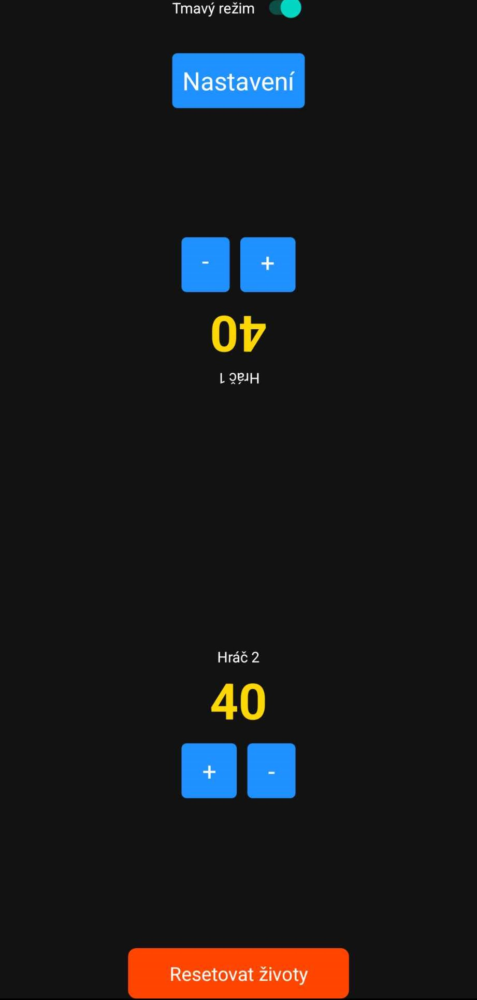
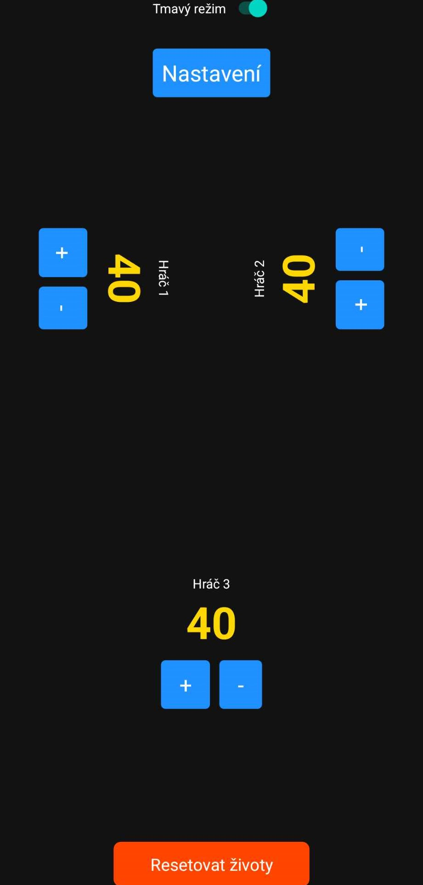
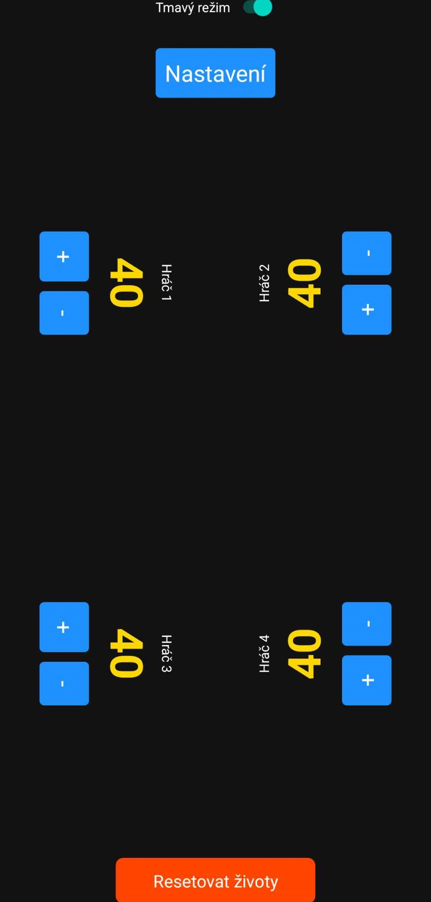
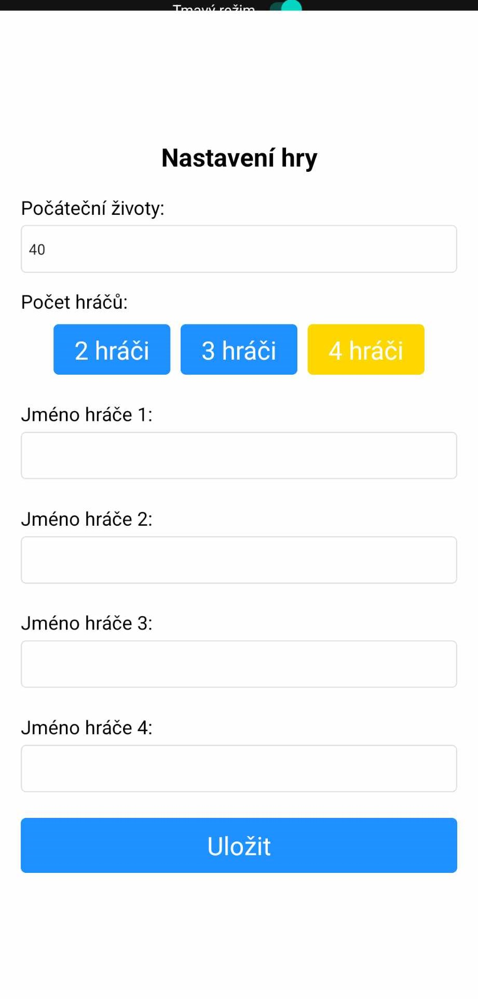

# Magic: The Gathering Life Counter

A simple and customizable life counter app for Magic: The Gathering (MTG) built with React Native and Expo. The app supports 2, 3, or 4 players and includes both dark and light modes. Players can easily keep track of their life points with an intuitive interface.

## Features

- **Player Count Options**: Supports 2, 3, or 4 players.
- **Dynamic Layout**: Layout adjusts based on the number of players:
  - 2 players: each takes half of the screen vertically, facing opposite directions.
  - 3 players: two players on top (facing each other) and one on the bottom.
  - 4 players: each player takes a quarter of the screen, with adjacent players facing away from each other.
- **Dark and Light Mode**: Switch between dark and light mode themes for better visibility.
- **Easy Life Adjustments**: Increase or decrease life points with one-touch controls.
- **Life Reset**: Reset all players' life points to the initial value.
- **Set you initial life value**: You can change the initial lfie value according to game format.
- **Change the player names**: You can set the player names to specify player positions on the screen.

## Screenshots

 
 

## Installation

1. **Clone the repository**:
   ```bash
   git clone https://github.com/yourusername/mtg-life-counter.git
   cd mtg-life-counter
   ```
2.  **Install dependencies**:
    ```bash
    npm install
    ```
3.  **Run the app**:
    ```bash
    npx expo start
    ```
